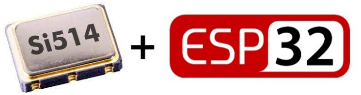

Texas Instruments Si514 is user programmable to any frequency from 100kHz to 250MHz. The Si514 uses single crystal and DSPLL synthesizer to generate any frequency across this range using simple I2C commands.
 
 
## why markdown is not wokring
