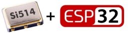
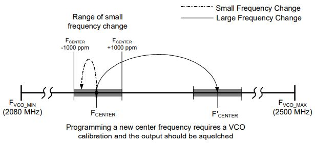

<p align="center">
  
</p>

## Contents
  * [Introduction](#introduction)
  * [Connection layout](#connection-layout)
  * [Project Directory](#project-directory)
  * [What Functionality does this Library Covers](#functionality)
  * [Resources](#resources)

## Introduction: <a name="introduction"></a>
**Texas Instruments Si514** is user programmable to any frequency from `100kHz` to `250MHz`. The Si514 uses single crystal and DSPLL synthesizer to generate any frequency across this range using simple **I**<sup>**2**</sup>**C** commands.

## Connection layout: <a name="connection-layout"></a>
The library is written for esp32 and the following pin configuration needs to be taken into account:
<br>
| ESP32 | Si514 |
| --- | --- |
| GPIO21   | SDA |
| GPIO22 | SCL |
| GND    | GND |
| 3.3V    | VDD |

## Project Directories: <a name="project-directory"></a>
The project is developed in Visual studio code under the PlatformIO extension. The code supports official docuemntation from [espressifs.](https://docs.espressif.com/projects/esp-idf/en/latest/esp32/api-reference/index.html) The structure of the files is shown below:
<br>
```
- include 
  --> si514.h
  --> si514.c
- src
  --> main.c
 ```
 The include folder contains header file and associated C file. The `main.c` file contains minimal example code. 

## What Functionality does this Library Covers: <a name="functionality"></a>
The device comes from the factory with a pre-programmed center frequency within the range of `100 kHz ≤ FOUT ≤ 250 MHz`, as specified by the 6-digit code in the part number. To change from the factory programmed frequency to a different value, the user must follow one of two algorithms based on the magnitude of the frequency change. This library only supports large frequency changes i.e. changes the frequency greater than `1000ppm` For more description, please refer to the [official datasheet](https://www.skyworksinc.com/-/media/Skyworks/SL/documents/public/data-sheets/Si514.pdf)
### Large Frequency Changes
Large frequency changes are those that vary the **F**<sub>**VCO**</sub> frequency by an amount greater than `±1000 ppm` from an operating FCENTER. Figure 1 illustrates the difference between large and small frequency changes.

<p align="center">
  
</p>

Changing to the new frequency requires modificaton of the internal register map. 

### How Library is working:
The `main.c` file contains minimum code example. The following `struct` needs to be changed to reset the oscillator to a new frequency settings. 
```
static config_t config = {
    .FVCO_min = 2080, 
    .HSDIV_max = 1022, 
    .FOUT = 51.84,
    .FXO = 31.98,
};
```


## Resources <a name="resources"></a>
1. [Si514 Datasheet](https://www.skyworksinc.com/-/media/Skyworks/SL/documents/public/data-sheets/Si514.pdf)
2. [ESP32 esp-idf I2C Documentation](https://docs.espressif.com/projects/esp-idf/en/latest/esp32/api-reference/peripherals/i2c.html)
